<Title>Welcome to DriveNet!</Title>

<p align="center">
  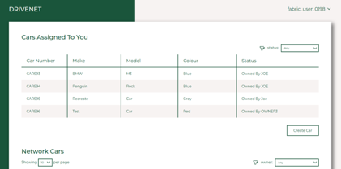
</p>

DriveNet is a **freely available Hyperledger Fabric test network** running on IBM Blockchain Platform.
Using just a web browser, it allows users to register with a real blockchain network and conduct meaningful transactions in around a minute, making it **excellent for live demonstrations**.
It is a shared environment that shows off the power of blockchain networks without resorting to smoke and mirrors. Interested users can dive into the developer and operation tools and see exactly what's going on.

> Conduct meaningful transactions from scratch in around a minute.

The demonstration consists of a single, shared Hyperledger Fabric network, smart contract and client application.
Anyone can join the network using just a valid email address; no credit cards or IBM Cloud ID is required, and there are **no onboarding or usage charges**.
Once joined, users can then invoke transactions on the blockchain network using the client application. More technical users can browse the smart contract, application source, and live underlying ledger using the IBM Blockchain Platform web console. It is also possible to develop custom applications that invoke the same smart contract, assisted by **fully guided tutorials** that are part of the IBM Blockchain Platform VS Code extension.

---

<Title>The scenario</Title>

DriveNet tracks the ownership of cars between users of a business network.
The business network consists of a connected set of small car dealers and owners, whose role is taken up by arbitrary users joining the network (i.e. you).
There is also a regulator role who ensures adherence to rules, played in this network by IBM.

<p align="center">
  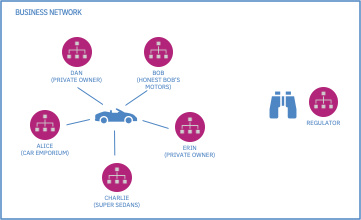
</p>

The business network maps to a Hyperledger Fabric network that consists of three organizations:
* a **shared community organization**, to whom the small car dealers and owners join (*Community Org*).
* a **separate organization** for the regulator (*IBM Org*).
* a **management organization** that runs the network's ordering service (*Ordering Org*).

<p align="center">
  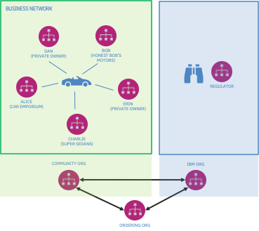
</p>

Users can get started by selecting the DriveNet network at https://fabnetworks.org and entering a valid email address.
The network will automatically assign them a userid and password to the **DriveNet web application** that allows them to create cars and transfer them to other users.

They will also receive a set of Hyperledger Fabric network credentials that allows developers to run custom DriveNet applications, and test using the **IBM Blockchain platform developer tools**.
They will also receive a login to the **IBM Blockchain Platform web console**, which enables basic administration tasks such as browsing the DriveNet ledger.

The network is accessible to any browser connected to the internet.

<InlineNotification kind="warning">

**There are limitations on the use of DriveNet:** The network is periodically wiped and rebuilt, making it unsuitable for long-term use. You cannot deploy your own smart contracts or create your own peers. The network has a limited capacity (500 users) and is not formally supported. Finally, as this is a shared environment, be sure not to use it for any sensitive data.

</InlineNotification>

To show off this network, learn the basic flow below and watch the video for an example demonstration.

---

<Title>Running DriveNet: Basic demonstration flow</Title>

*The DriveNet demonstration is split into three sections. They should be presented in order, but for less technical audiences you might choose to stop after 'Try the network'.*
*If you do aim to cover the development and administration sections, doing some optional pre-demo setup tasks will make for a slicker demo; these are marked inline with* `** pre-demo task`. *You can then skip these steps when presenting live.*

<Accordion>

<AccordionItem title="Try the network">

*In this section you will discover and join the DriveNet network, and use it to conduct some transactions using a simple web application.*

<br/>

<InlineNotification kind="info">

**Stay high level!** Keep the demo moving and don't get bogged down; subsequent sections will allow you dive into detail. Concentrate on the *what* and not the *how*.

</InlineNotification>

&nbsp;<br/>

 **1** &nbsp;&nbsp;&nbsp;&nbsp;

Start, if necessary, by briefly explaining the key concepts that underpin blockchain: business networks, assets, transactions and ledgers.

&nbsp;<br/>

 **2** &nbsp;&nbsp;&nbsp;&nbsp;

Introduce the DriveNet scenario: describe the business network and what you are going to demonstrate.

&nbsp;<br/>

 **3** &nbsp;&nbsp;&nbsp;&nbsp;

Bring up a web browser and go to https://fabnetworks.org. You can invite your audience to do the same so they can play along; they can even play an active part in the demo - see later.

<p align="center">
  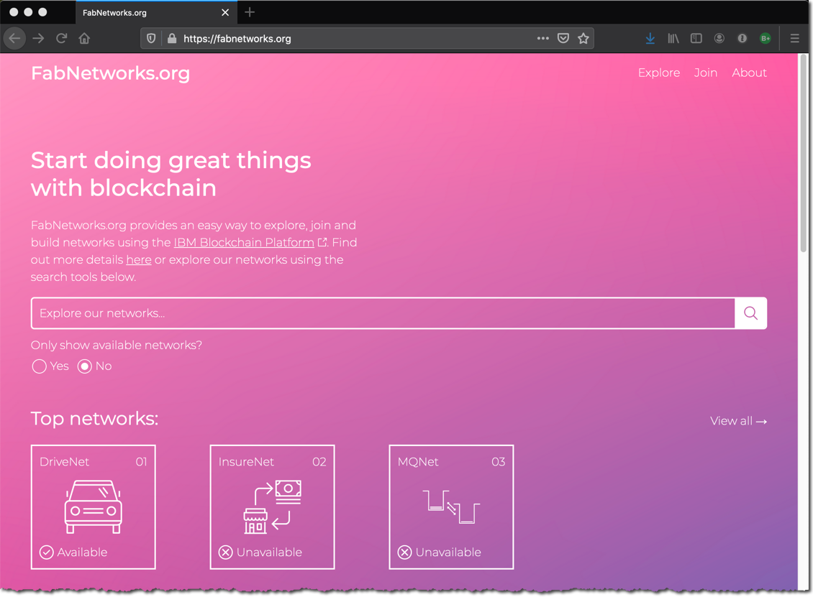
</p>

*This site shows a live blockchain registry, whose purpose is to allow users to discover Hyperledger Fabric networks and join them. Shown networks might vary over time.*

&nbsp;<br/>

 **4** &nbsp;&nbsp;&nbsp;&nbsp;

Click on the DriveNet icon. Explain the network's details that are now shown, and scroll to the bottom. Enter your email address and click 'Go'.

<p align="center">
  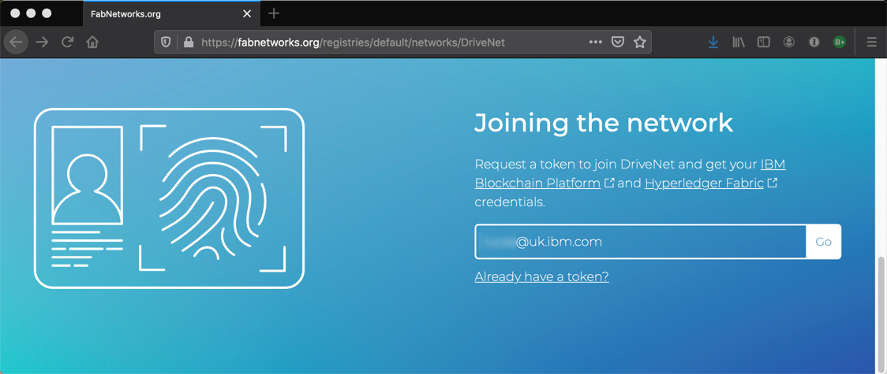
</p>

*If you have registered for the same network instance before, you can still enter your email address here; you will get back an identical token.*

&nbsp;<br/>

 **5** &nbsp;&nbsp;&nbsp;&nbsp;

Refresh your email client to find an message from blockchain@uk.ibm.com, which contains a token (a long hexadecimal string). Copy and paste the token into the prompt that appears and click 'Go'.

<p align="center">
  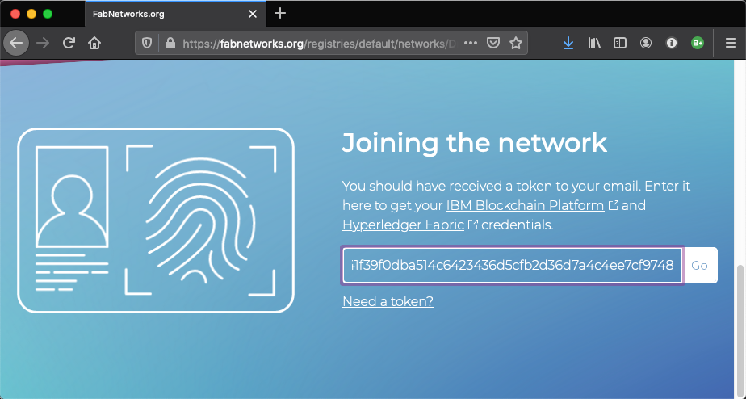
</p>

*This step is used to validate the email address. Note however that email addresses are not stored by IBM at any point during this process. IBM retains a one-way hash of the address to ensure that if someone registers a second time, they will get back the same token.*

&nbsp;<br/>

 **6** &nbsp;&nbsp;&nbsp;&nbsp;

You will now see a set of login credentials for DriveNet. Focus on the 'Application details' section, and click on the arrow icon on the far right of the 'Application' text box to launch the DriveNet web application in a new browser window.

<p align="center">
  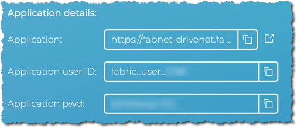
</p>

*The boxed icons immediately to the right of the text boxes will copy the associated value to your clipboard. Be sure to make use of this in follow-on steps.*

&nbsp;<br/>

 **7** &nbsp;&nbsp;&nbsp;&nbsp;

Log on to the DriveNet web application using the application user and password given to you on the previous page.

<p align="center">
  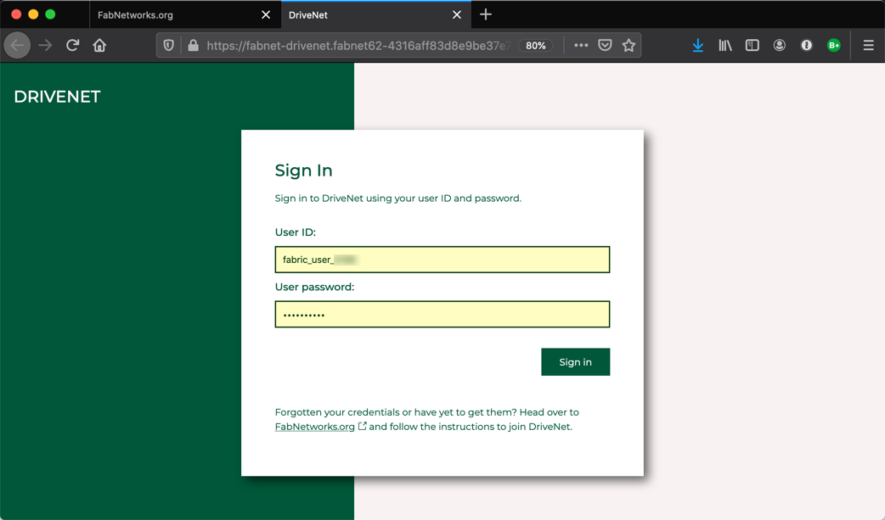
</p>

*Once you're logged in, take some time to explain the web application. The 'Cars Assigned to You' shows you the car records that are under your control; the 'Network cars' section shows you all car records in the network. If this is the first time you've logged on, the former section will be empty.*

<p align="center">
  
</p>

&nbsp;<br/>

 **8** &nbsp;&nbsp;&nbsp;&nbsp;

Click on 'Create a car' and go through the process of creating a new car record. Pick a unique ID (the default value should be fine), and enter a make, model and color. Keep the owner field defaulted to your application userid for now.

<p align="center">
  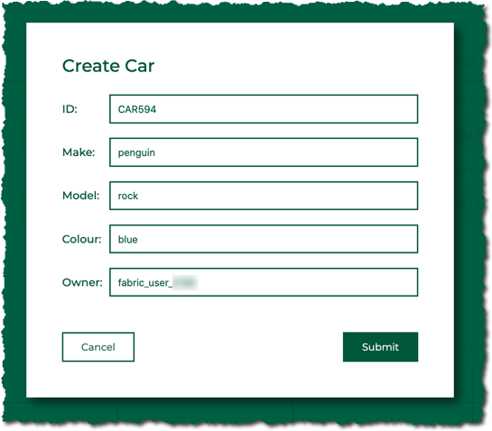
</p>

*Car IDs are of the form CARnnnn, where nnnn is a number between 0 and 9999. IDs are shared between all users of the network; if you are unable to create a vehicle, check that a car with that ID has not already been created. Note that the application tries to select a default value for the ID that is unassigned.*

&nbsp;<br/>

 **9** &nbsp;&nbsp;&nbsp;&nbsp;

Register a second user with the network. In order to get back different credentials, you need to use a different email address.

*There are several ways you can do this:
&nbsp;<br/>a. Start a second browser window along side the first, and head once more to fabnetworks.org. Don't use browser tabs - keep the windows separate to avoid confusion.
&nbsp;<br/>b. Get someone in your audience to register (if they are willing to use their email address).
&nbsp;<br/>c. If you have more technical people in the room, you can demonstrate the command line way of joining:*

```sh
sudo npm install -g fabnet
fabnet list
fabnet join -n DriveNet -u email@address.com
fabnet join -n DriveNet -u email@address.com -t myToken
```

&nbsp;<br/>

*Substitute the email address and token as appropriate.*

&nbsp;<br/>

<p align="center">
  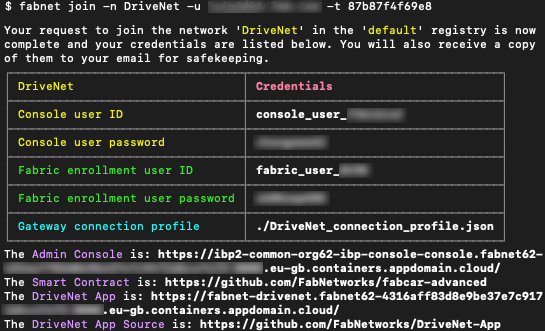
</p>

&nbsp;<br/>

 **10** &nbsp;&nbsp;&nbsp;&nbsp;

Log the second user onto the DriveNet web application. Note how the second user does not have any car records.

<InlineNotification kind="warning">

**Warning:** For the second user, use a different browser type (Firefox, Safari etc.) or enable private mode browsing. This is because you can only log on as one user per browser instance. If you don't do this, you will not be able to work as both users simultaneously.

</InlineNotification>

<br/>

<p align="center">
  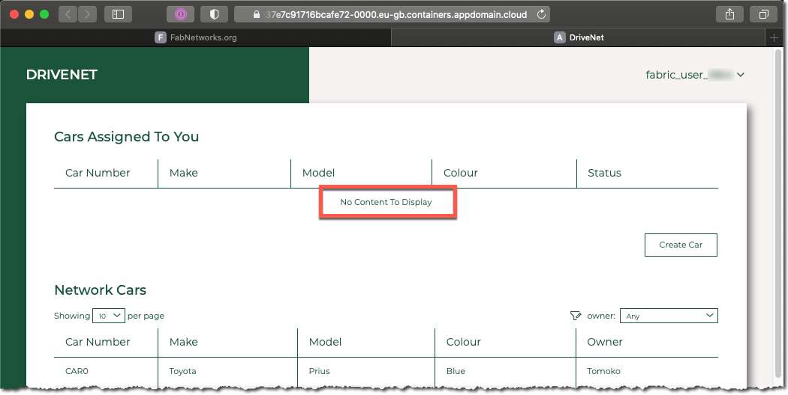
</p>


&nbsp;<br/>

 **11** &nbsp;&nbsp;&nbsp;&nbsp;

Return to the **first user's** DriveNet web application. Select the car that the first user created, and use the 'Actions' button to run a transaction to transfer the car to our second user.

<p align="center">
  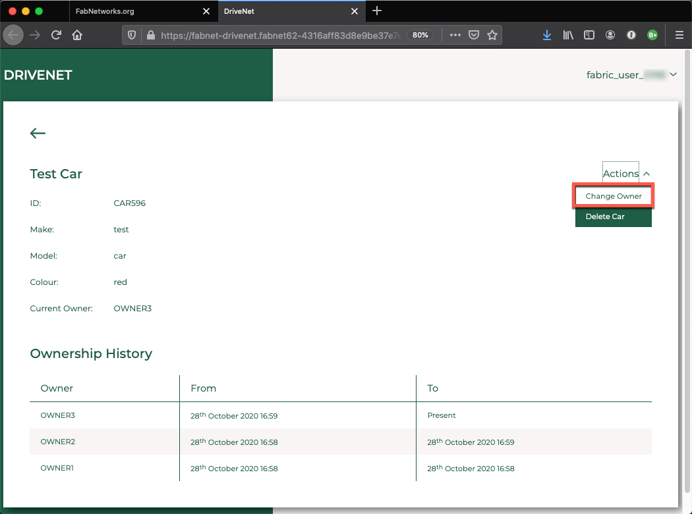
</p>

*Be sure to set the 'New owner' field to be the second user's **application userid** (aka Fabric enrollment ID), and not their email address!*

<p align="center">
  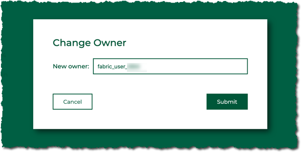
</p>

*For the first user, note that the status is now 'Awaiting New Owner'. The second user needs to accept the transaction.*

<p align="center">
  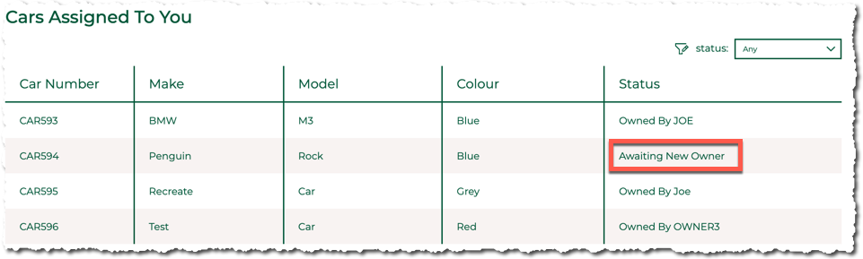
</p>

&nbsp;<br/>

 **12** &nbsp;&nbsp;&nbsp;&nbsp;

Refresh the **second user's** DriveNet web application. Notice how the car now appears in their list with the status 'Pending Your Confirmation'.
Select the car and click 'Actions' -> 'Confirm Ownership'.

<p align="center">
  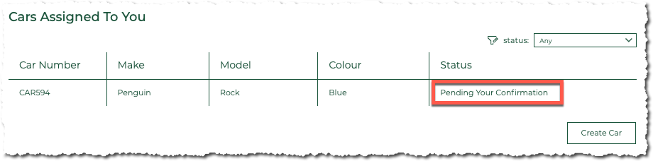
</p>

&nbsp;<br/>

<p align="center">
  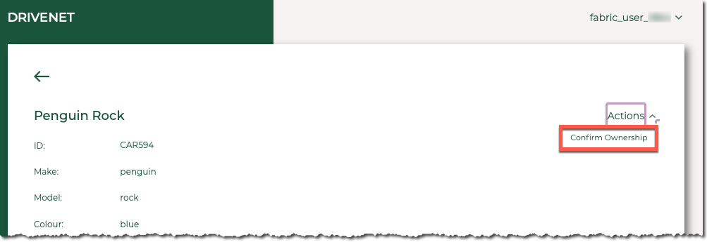
</p>

*The car's status as reported by the second user's web application as 'Owned'. If you select the car, notice that the full ownership history is shown; this is because blockchain retains all transaction details - a property known as **provenance**.*

*Note also that the car will not be listed in the Assigned section of the first user's application at all, because they have relinquished ownership.*

&nbsp;<br/>

*This is the end of the basic demo. For audiences who want to look in detail at how this is built, continue with the next section where we will look at the smart contract and application using the IBM Blockchain Platform developer tools.*

</AccordionItem>

<AccordionItem title="Development environment">

*In this section you will explore the developer tools, apps and smart contract that underpin DriveNet. As a reminder, it is recommended that steps marked with* `** pre-demo task`
*be completed in advanced of any live demonstration.*

*For the remainder of the demonstration we will use the first set of credentials only. If necessary, you can close down the second user's windows.*

&nbsp;<br/>

 **13** &nbsp;&nbsp;&nbsp;&nbsp; `** pre-demo task`

Install [VS Code](https://code.visualstudio.com/) and the [IBM Blockchain Platform VS Code extension](https://marketplace.visualstudio.com/items?itemName=IBMBlockchain.ibm-blockchain-platform).

&nbsp;<br/>

 **14** &nbsp;&nbsp;&nbsp;&nbsp;

Return to the first user's credentials in fabnetworks.org and look at the 'Developer details' section. Copy the value of the 'Smart contract' field.

<p align="center">
  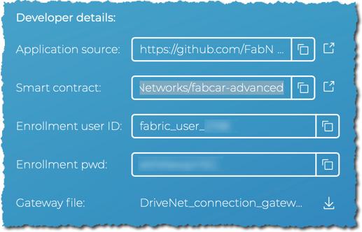
</p>

&nbsp;<br/>

 **15** &nbsp;&nbsp;&nbsp;&nbsp;

Open the 'Source control' side bar and click the 'Clone repository' button. If the workspace is not empty, you can alternatively click the ellipsis at the top of the side bar and select 'Clone'). Enter the smart contract URL that was copied previously.

<p align="center">
  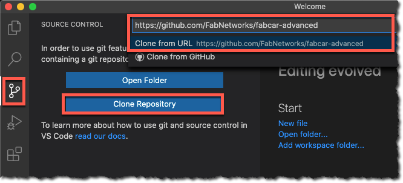
</p>

*Explain the smart contract. The best place to start is the* `src/fabcar.ts` *file. The methods decorated with* `@transaction` *denote the transactions that are exposed by the smart contract - for example,* `createCar`.

<p align="center">
  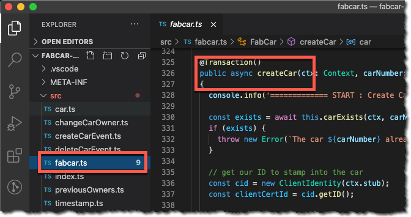
</p>

&nbsp;<br/>

 **16** &nbsp;&nbsp;&nbsp;&nbsp;

Repeat the process for the app: clone the client application repository using the 'Application source' URL from fabnetworks.org.

*The interaction with Hyperledger Fabric is contained within* `src/Util/FabricProxy.ts` *, but a better file to walk through is* `src/Transactions/Transactions.ts` *, which submits the transactions that work with cars.*

<p align="center">
  
</p>

&nbsp;<br/>

 **17** &nbsp;&nbsp;&nbsp;&nbsp; `** pre-demo task`

Follow the 'Joining a network' Tutorials of the IBM Blockchain Platform VS Code extension, to connect a gateway to DriveNet from within VS Code.

*Given you have already acquired your connection details, start from the middle of tutorial B2 when you connect to the web console for the first time. You can stop once your gateway is connected in tutorial B5.*

<p align="center">
  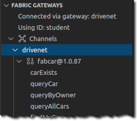
</p>

&nbsp;<br/>

 **18** &nbsp;&nbsp;&nbsp;&nbsp;

Demonstrate the IBM Blockchain Platform development environment.

*For example, you could query the car that was created previously. Invite the audience to review the built-in tutorials if they would like to learn how to get started.*

&nbsp;<br/>

*This is the end of the developer section. For audiences who want to look in detail at the administration tools, continue with the final section.*

</AccordionItem>

<AccordionItem title="Administration environment">

*In this final part of the demonstration we will look under the hood at the blockchain itself, using the IBM Blockchain Platform web console.*

*It requires you to have already enrolled with the DriveNet CA and peer; you should have done this during the B tutorials in the last section.*

&nbsp;<br/>

 **19** &nbsp;&nbsp;&nbsp;&nbsp;

Return to the first user's credentials screen on fabnetworks.org, and this time focus on the 'Administration Details' section. Click the right-most icon to launch a new browser window 

<p align="center">
  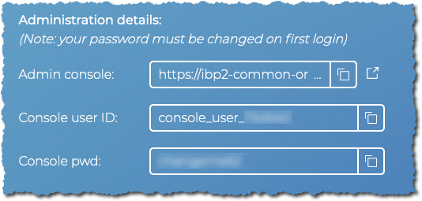
</p>

&nbsp;<br/>

 **20** &nbsp;&nbsp;&nbsp;&nbsp;

Log on to the web console using the ID supplied by fabnetworks.org.

*As you already logged on to the web console in the developer section, you will have already changed your password from the one shown.*

<p align="center">
  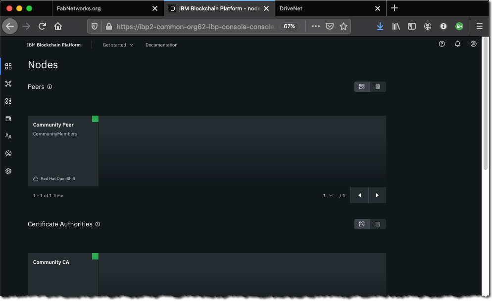
</p>

*Use this opportunity to talk through the major elements of the web console (the icons down the left hand side, the peers, CAs and orderers etc.)*

&nbsp;<br/>

 **21** &nbsp;&nbsp;&nbsp;&nbsp;

Click on 'Channels' -> 'drivenet'.

<p align="center">
  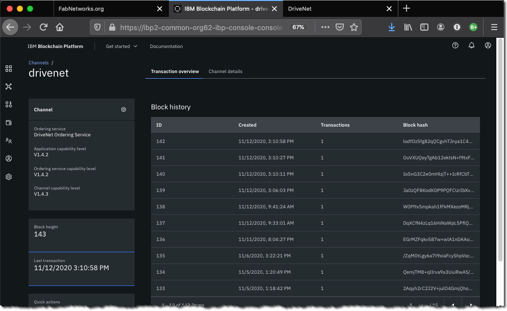
</p>

*Browse and explain the block history. You should be able to find the transactions you previously submitted.*

<p align="center">
  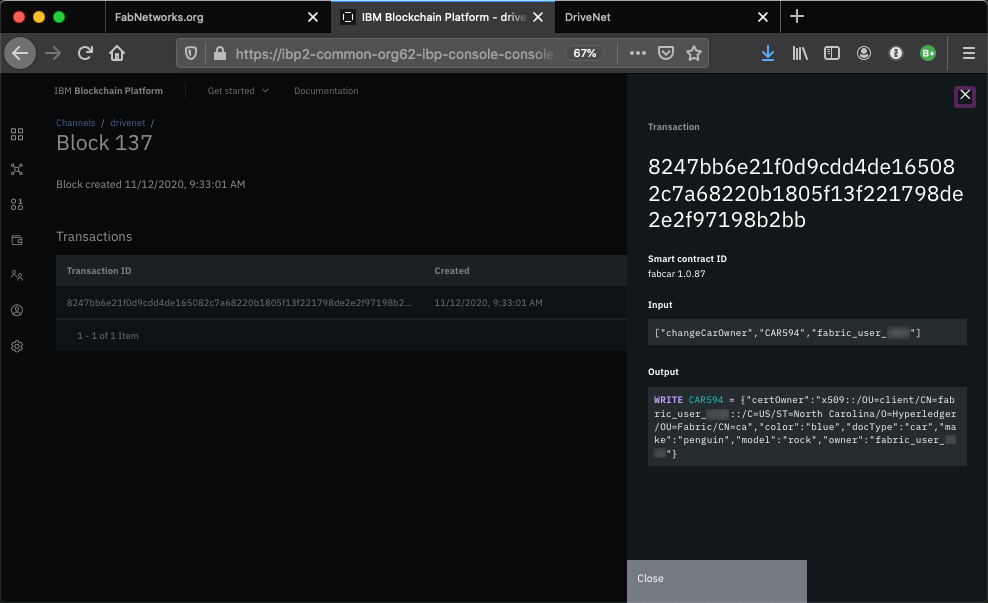
</p>

&nbsp;<br/>

*This concludes the demonstration.*

</AccordionItem>

</Accordion>

---

<Title>See it!</Title>

<Video title="DriveNet demonstration" vimeoId="483965224" />

A copy of the [video script](./videos/demo-script.txt) is also available.

---

<Title>Contacts</Title>

If you have any questions about this network, please contact blockchain@uk.ibm.com.
